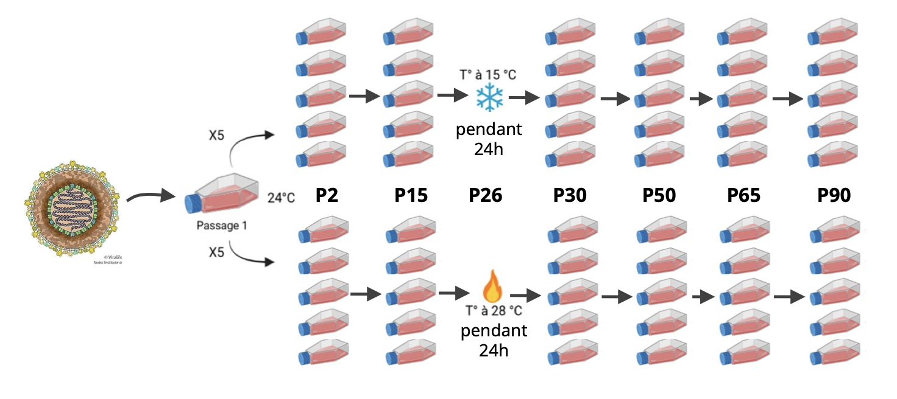

# Bioinformatics Learning Lab (BILL) 2025
## introduction :
This repository is dedicated to the BILL project of Bioinformatics masters - UMontpellier, group 3. The data used is the result of viral cultures of *Cyprinid herpesvirus 3 strain KHV-U*. Following the protocol here below :

On january 2025, the master students worked on the generation **P90**. extracting viral genomic DNA and sequencing using minION (Oxford Nanopore).

## Analysis:
The end goal of this practical course is to learn to :
- Parse VCF files.
- Compare the files issued from the different shocks (heat/cold).
- Analyse the mutations found.
- Calculate the mutation rates before and after the shock.
- Plot the variation in the mutation rates over time.

## Usage:
